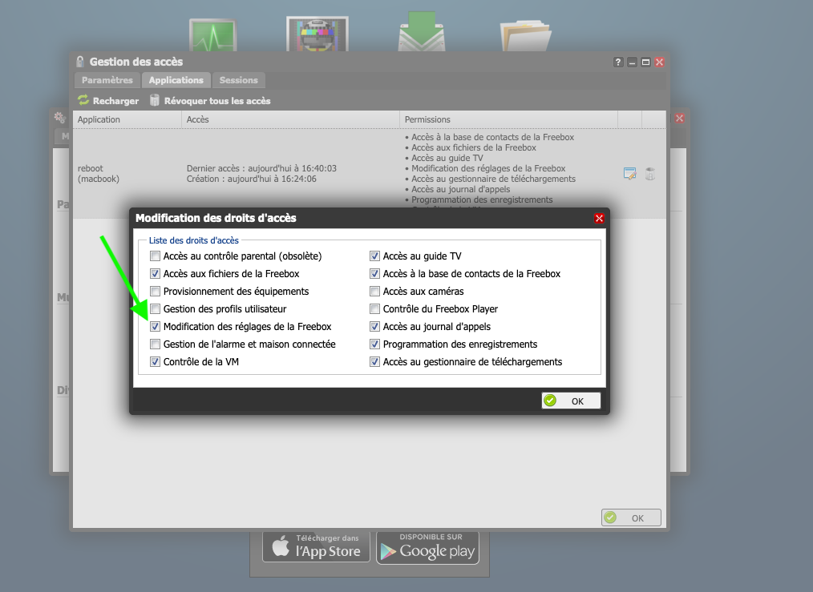

# Reboot Freebox Mini 4K

La Freebox Mini 4K en mode "bridge" se fige régulièrement.
Il faut la rebooter pour retrouver une connexion viable.

Avec ce script, la freebox sera rebooté à chaque perte de connexion internet.

## Iliadbox

Lo script funziona anche con la iliadbox in Italia / Ce script fonctionne aussi avec la iliadbox en Italie.

## Comment construire ?

```
> docker build . -t reboot_freebox
```

## Comment télécharger une image déjà construite ?

```
> docker pull ghcr.io/sylvek/freebox_reboot:latest
```

## Comment rebooter la freebox ?

### Premier lancement

Dans un premier temps, il faut lancer le script et récupérer l'`APP_TOKEN`. Celui-ci s'écrit automatiquement dans `$HOME/.reboot_freebox`

Le script demandera d'accepter l'interaction du script avec la freebox.
Regardez votre freebox une question vous est posée. Il faudra accepter en cliquant sur la flèche de droite.

Par la suite, l'APP_TOKEN vous sera fourni.

Il vous faudra réaliser une seconde manipulation, via l'interface de la freebox, Mode avancé > Divers > Gestion des accès > Application.

Cocher "Modification des réglages de la Freebox"



### Ensuite…

depuis docker.

```
> docker run --rm -ti -v $HOME/reboot_freebox:/root/.reboot_freebox reboot_freebox
```

Chaque lancement du script génèrera un reboot de la freebox.
un `exit 100` sera renvoyé en cas de problème.

### Un cron

Vous pouvez mettre en place un cron comme suit

```
*/5 * * * * ./reboot_freebox.sh
```

avec `reboot_freebox.sh`

```
#!/bin/bash
ping -c 1 google.com &> /dev/null || docker run --rm -ti -v $HOME/reboot_freebox:/root/.reboot_freebox ghcr.io/sylvek/freebox_reboot
```
